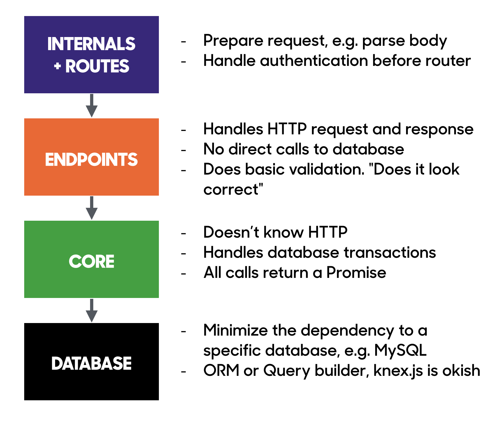

# Express error handling example

**This example will not run! Some parts are not implemented.**

Here's how the Express API application has been architectured in the example:

Good with this setup:

* Your code can leverage Promises
* Testable

    * Express app instance can be created with a function
    * Router instance can be created with a function
    * Core methods are testable. This would allow you to write some lower level tests.

        Note: even though they are testable, usually you get the best ROI by testing
        with real HTTP API calls. In other words: put your express app running locally, init db to
        certain state, and fire http requests to localhost with e.g. supertest lib.

* Provides a minimal but nice "frame" around your development with separation of concerns
* Error handling is done in one place, in the error-handling middlewares defined in app.js
* Your request handling code can throw errors and they will be handled at the app level

    No need to repeat the `next(err)` pattern in all your
    request handlers.
